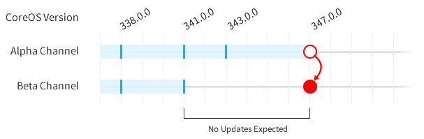

Switching release channels
--------------------------

Container Linux is designed to be
https://coreos.com/why/#updates[updated automatically] with different
schedules per channel. You can link:update-strategies.md[disable this
feature], although we don’t recommend it. Read the
https://coreos.com/releases[release notes] for specific features and bug
fixes.

By design, the Container Linux update engine does not execute
downgrades. If you’re switching from a channel with a higher Container
Linux version than the new channel, your machine won’t be updated again
until the new channel contains a higher version number.

Create update config file
~~~~~~~~~~~~~~~~~~~~~~~~~

You can switch machines between channels by creating
`/etc/coreos/update.conf`:

[source,ini]
----
GROUP=beta
----

Restart update engine
~~~~~~~~~~~~~~~~~~~~~

The last step is to restart the update engine in order for it to pick up
the changed channel:

[source,sh]
----
sudo systemctl restart update-engine
----

Debugging
~~~~~~~~~

After the update engine is restarted, the machine should check for an
update within an hour. You can view the update engine log if you’d like
to see the requests that are being made to the update service:

[source,sh]
----
journalctl -f -u update-engine
----

For reference, you can find the current version:

[source,sh]
----
cat /etc/os-release
----
