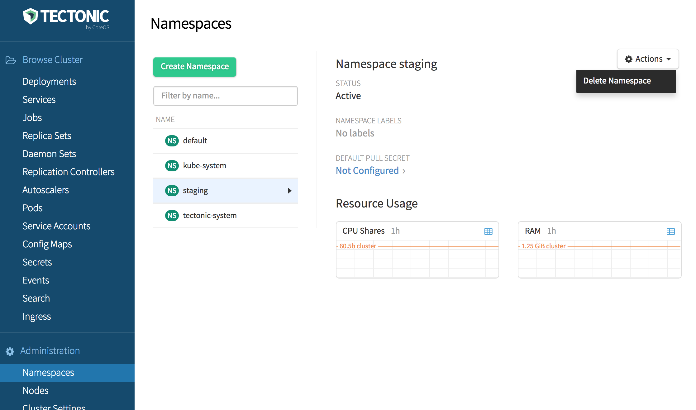

Managing Namespaces in Tectonic
-------------------------------

Namespaces are one way that Kubernetes scopes and restricts resource
usage within a single cluster.

For those looking to administrate users on a Tectonic Kubernetes
cluster, read the link:../users/tectonic-identity-config.md[User
Management guide] which covers
https://kubernetes.io/docs/admin/authorization/#rbac-mode[Kubernetes
Role Based Access Controls].

Create a namespace with kubectl
~~~~~~~~~~~~~~~~~~~~~~~~~~~~~~~

To create a Kubernetes namespace, create a yaml resource file
`staging.yaml` with the following contents:

[source,yaml]
----
apiVersion: v1
kind: Namespace
metadata:
  name: staging
----

The Namepsace can be created, used, and deleted with the following
commands:

....
$ kubectl create -f staging.yaml
namespace "staging" created
$ kubectl get namespace staging
NAME      STATUS    AGE
staging   Active    1m
$ kubectl run nginx --image=nginx --namespace=staging
deployment "nginx" created
$ kubectl describe namespace staging
Name:   staging
Labels: <none>
Status: Active

No resource quota.

No resource limits.
$ kubectl get deployments --namespace=staging
NAME      DESIRED   CURRENT   UP-TO-DATE   AVAILABLE   AGE
nginx     1         1         1            1           3m
$ kubectl delete namespace staging  # This deletes all resources under the `staging` namespace!
namespace "staging" deleted
....

Monitor namespaces with Tectonic Console
~~~~~~~~~~~~~~~~~~~~~~~~~~~~~~~~~~~~~~~~

Once a Namespace is set on a cluster, that namepsace’s can be monitored
by toggling the ``Namespace'' dropdown at the top of the page. A list of
Namespaces can be viewed in the _Admin_ section of the Console.

Check out the https://kubernetes.io/docs/admin/namespaces/[Kubernetes
Namespace User Guide] for more information about Kubernetes Namespaces.
